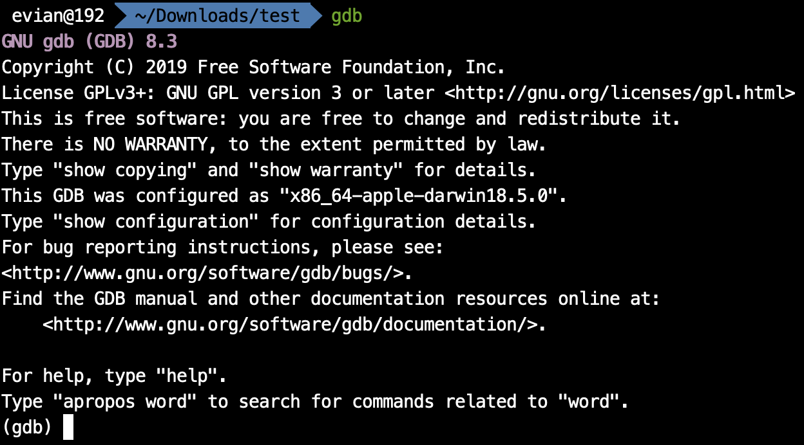
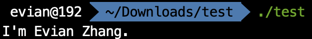
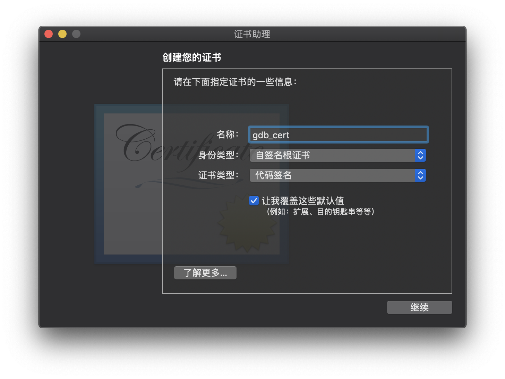
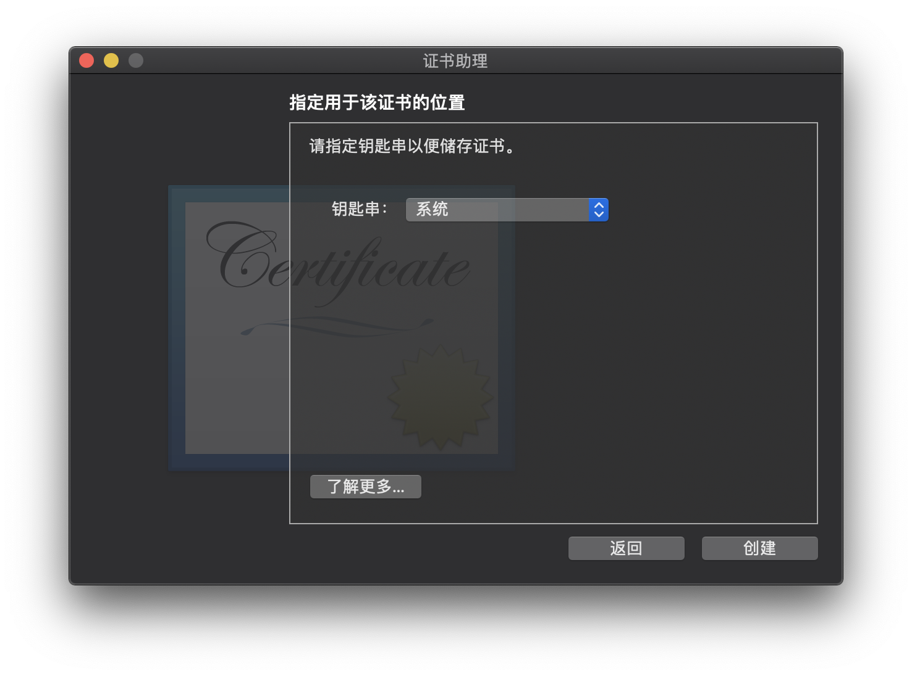
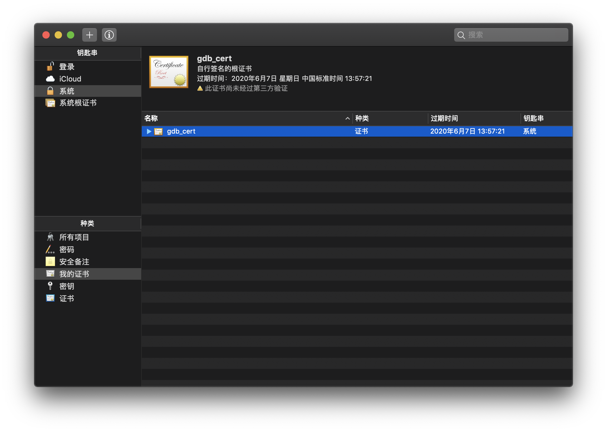

# 背景

在macOS上，用于debug的工具有lldb和gdb. 其中lldb作为一种可复用的组件，参与了大型llvm项目库的构成；同时，lldb也是Xcode默认的调试工具, 支持Windows, macOS, iOS, Linux和FreeBSD. 而gdb是GNU项目的调试器，支持Windows和大多数UNIX变种，也包括macOS.

相比而言，lldb是苹果的"亲儿子"，所以当我们调试Objective-C和swift的程序的时候，倾向于使用lldb. 但是，lldb也有其力所不能及之处，那就是多语言支持。lldb仅支持C, C++, Objective-C, 而对swift的支持也是Apple自己编写的swift-lldb([apple/swift-lldb](https://github.com/apple/swift-lldb))才行得通的。因此，当我们使用macOS进行其他语言（如汇编等）的编程时，往往使用gdb来进行调试。

但是，自从macOS进入10.14以后，对这类调试工具的要求越来越苛刻，现在国内网上找到的许多教程都已经过时，按照教程做依然不能完成。下面，我就从安装开始，一直介绍到能顺利运行gdb.

# 安装

建议使用homebrew安装，即在终端中键入

```bash
brew install gdb
```

安装完成后，gdb应该会位于`/usr/local/bin/gdb`

然后在终端中键入`gdb`, 就会出现



```bash
gdb
GNU gdb (GDB) 8.3
Copyright (C) 2019 Free Software Foundation, Inc.
License GPLv3+: GNU GPL version 3 or later <http://gnu.org/licenses/gpl.html>
This is free software: you are free to change and redistribute it.
There is NO WARRANTY, to the extent permitted by law.
Type "show copying" and "show warranty" for details.
This GDB was configured as "x86_64-apple-darwin18.5.0".
Type "show configuration" for configuration details.
For bug reporting instructions, please see:
<http://www.gnu.org/software/gdb/bugs/>.
Find the GDB manual and other documentation resources online at:
    <http://www.gnu.org/software/gdb/documentation/>.

For help, type "help".
Type "apropos word" to search for commands related to "word".
(gdb)
```

键入`q`并回车即可退出。

# 证书签名

在使用homebrew下载完gdb之后，是不能立刻使用的。比如说我有一个最基础的x86-64汇编程序`test.asm`：

```assembly
SECTION .data


EatMsg: db "I'm Evian Zhang.", 0x0a
EatLen: equ $-EatMsg

SECTION .bss

SECTION .text

global main

main:
	nop
	mov rax,0x2000004
	mov rdi,1
	mov rsi,EatMsg
	mov rdx,EatLen
	syscall

	mov rax,0x2000001
	mov rdi,0
	syscall
```

我用nasm汇编，ld链接完成之后的文件`test`, 运行一下，结果是输出`I'm Evian Zhang.`

```bash
./test
I'm Evian Zhang.
```



但是，如果我使用`gdb test`对`test`进行调试，然后在命令行中键入`run`, 则会报错：

```
>run

Starting program: /Users/evian/Downloads/test/test 

Unable to find Mach task port for process-id 358: (os/kern) failure (0x5).

(please check gdb is codesigned - see taskgated(8))
```

这是没有证书的缘故。接下来，我们需要使用证书对gdb进行签名：

1. 打开应用程序>其他>钥匙串访问
   

2. 在菜单栏中选择证书助理>创建证书
   

3. 名称随便填(比如说gdb_cert), 身份类型为「自签名根证书」，证书类型为「代码签名」，并勾选「让我覆盖这些默认值」。
   

4. 一路继续，直到让我们指定用于该证书的位置，选择「系统」。然后输入密码即可创建。
   

5. 接着，我们可以在「系统」钥匙串的「我的证书」种类中找到这个证书。
   

6. 双击该证书打开，然后展开「信任」栏目，将「使用此证书时」选择为「始终信任」，关闭时输入密码即可保存。
   

7. 新建一个叫做`gdb-entitlement.xml`的文件，其内容为

   ```xml
   <?xml version="1.0" encoding="UTF-8"?>
   <!DOCTYPE plist PUBLIC "-//Apple//DTD PLIST 1.0//EN" "http://www.apple.com/DTDs/PropertyList-1.0.dtd">
   <plist version="1.0">
   <dict>
       <key>com.apple.security.cs.debugger</key>
       <true/>
   </dict>
   </plist>
   ```

8. 在终端键入

   ```bash
   codesign --entitlements gdb-entitlement.xml -fs gdb-cert /usr/loacl/bin/gdb
   ```

# 配置gdb

在签名过后，我们终于可以使用gdb了，但是，当我们输入`run`的时候，新的问题出现了：

```
>run
Starting program: /Users/evian/Downloads/test/test
[New Thread 0x1803 of process 1090]
[New Thread 0x1903 of process 1090]
```

然后整个gdb就卡住了，必须使用control+Z才能退出。

我们需要在命令行中键入

```bash
echo "set startup-with-shell off" >> ~/.gdbinit
```

然后就可以正常使用gdb了。